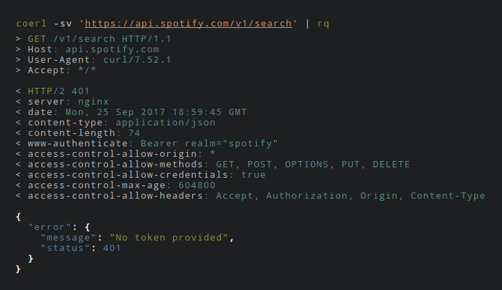

# coerl

coerl colourises [curl]'s output.

[curl]: https://curl.haxx.se

## Usage

Use coerl instead of curl. curl is still required.

```sh
$ COERL_SSL_DATA_OFF=0 coerl -vs -d '{}'
$ COERL_TEXT_OFF=1 COERL_SSL_DATA_OFF=1 coerl --compressed -sv 'https://api.spotify.com/v1/search' | jq .

$ alias curl=coerl
$ curl -sv -L https://google.com > /dev/null
$ COERL_DATA_OFF=1 COERL_TEXT_OFF=1 curl -sv -L https://google.com > /dev/null
```

[](coerl.png)

## Installation

```sh
$ go get -u github.com/op/coerl
```

## Knobs

Customise coerl by using environmental variables.

* `COERL_CURL_BIN` -- path to executable [curl]

Colors:

* `COERL_HEADER`
* `COERL_TEXT`
* `COERL_DATA`
* `COERL_SSL_DATA`

Silence output:

* `COERL_HEADER_OFF`
* `COERL_TEXT_OFF`
* `COERL_DATA_OFF`

### Even more knobs

These knobs also exist but defaults to the corresponding ones above.

* `COERL_HEADER_OUT`
* `COERL_HEADER_IN`
* `COERL_DATA_IN`
* `COERL_DATA_OUT`
* `COERL_SSL_DATA_IN`
* `COERL_SSL_DATA_OUT`

* `COERL_HEADER_OUT_OFF`
* `COERL_HEADER_IN_OFF`
* `COERL_DATA_IN_OFF`
* `COERL_DATA_OUT_OFF`
* `COERL_SSL_DATA_OFF`
* `COERL_SSL_DATA_IN_OFF`
* `COERL_SSL_DATA_OUT_OFF`

## Background

Short version:

* `-v` has too much data
* `-I` writes to stdout and breaks piping
* colours can help

curl together with its (verbose) output is great in many ways. The
`--include` flag includes the HTTP-header in the output. However this
breaks piping of the output, to eg. [jq] or [rq], since headers are
written to stdout. Using the `--verbose` flag fixes this but also
introduces heaps of output.

[jq]: https://stedolan.github.io/jq/
[rq]: https://github.com/dflemstr/rq

This hack adds some colours to the `--verbose` output of curl.

Credit goes to [httpstat] for inspiration.

[httpstat]: https://github.com/reorx/httpstat

## Limitations

Guessing is done to determine if the data is for SSL or not.
